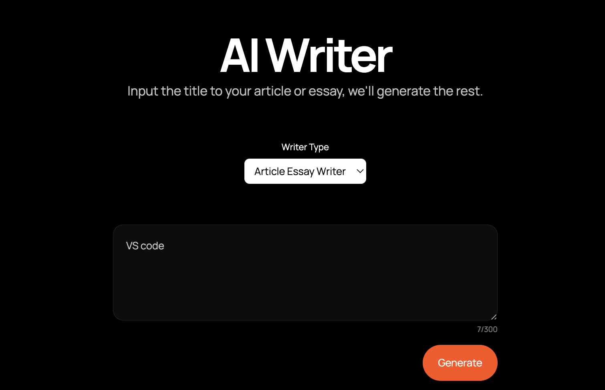

# AI Writer 

This project is an AI writing assitant powered by the [GPT-3.5 Turbo](https://platform.openai.com/docs/models/gpt-3-5-turbo) model from [openAI](https://openai.com).

You can access the AI Writer [here](https://8h9g4f-3000.csb.app/).

The AI writer offers three base services:
- Article Essay Writer
- Text Summariser
- Text Proof Reader

It includes a feedback form where you can also suggest additional functionalities to implement.

### Technologies used:
- [Nextjs](https://nextjs.org/)
- [Tailwindcss](https://tailwindcss.com/)
- [OpenAI node api library](https://www.npmjs.com/package/openai)

### Acknowledgment
This project was built using the starter template for the [build your own AI writing assistant w/ GPT-3](https://buildspace.so/builds/ai-writer) project from [buildspace](https://buildspace.so). 

